# CFI Hotels Group - katalog potencjalu konferencyjno-eventowego

Wersja robocza: podzial wedlug miast i lokalizacji. Katalog obejmuje hotele, obiekty noclegowe, restauracje oraz przestrzenie eventowe, w tym Tekture by Farina Bianco / Tekture Boho i sale 99 Hz.

## Koncepcja katalogu

Glowna narracja:

**CFI Hotels Group jako jeden partner do konferencji, eventow, bankietow, integracji, noclegow i kolacji biznesowych w wielu lokalizacjach w Polsce.**

Podzial sprzedazowy:

- **Centra konferencyjne i duze hotele eventowe** - Warsaw Plaza, Falenty, Premier/Express Krakow, Krol Kazimierz, Masuria.
- **City MICE i obiekty noclegowe** - Lodz, Wroclaw, Poznan, Sosnowiec, Bytom.
- **Restauracje i event dining** - Tektura, 99 Hz, Farina Bianco, Gesi Puch, TABU Sushi, Rozlam i inne restauracje CFI.

## Warszawa / Raszyn

### Warsaw Plaza Hotel

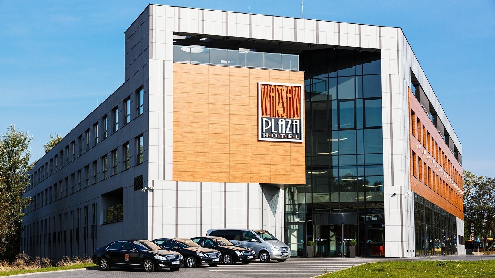

**Rola w katalogu:** flagowy hotel biznesowy przy Lotnisku Chopina.

**Potencjal MICE:**

- 17 sal konferencyjnych wedlug fact sheetu WPH 2025.
- Eventy do 800 osob.
- 800 m2 przestrzeni bankietowej po polaczeniu sal na parterze i restauracji.
- 146 pokoi / 292 miejsca noclegowe.
- 101 miejsc parkingowych zewnetrznych + 65 miejsc w garazu.
- 15 sal ze swiatlem dziennym.
- Mozliwosc wprowadzenia samochodow do restauracji i sal na parterze.

**Najlepsze zastosowania:** konferencje korporacyjne, kongresy, bankiety, premiery produktow, eventy automotive, wydarzenia przy lotnisku.

**Zrodla:** `Fact sheet WPH 2025.pdf`, `https://warsawplazahotel.pl/`

### Falenty Biznes i Wypoczynek

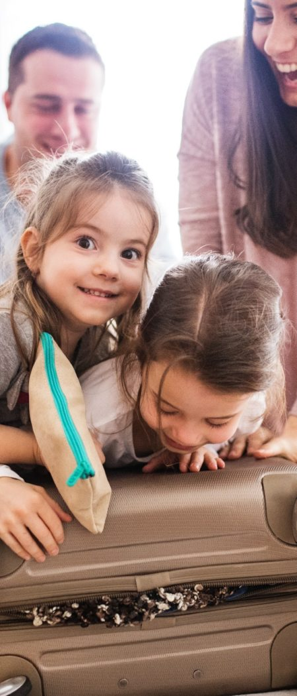

**Rola w katalogu:** podwarszawski obiekt konferencyjno-eventowy z terenem zielonym.

**Potencjal MICE:**

- 13 sal konferencyjnych.
- Ok. 2000 m2 przestrzeni konferencyjnej.
- 107 pokoi / 214 miejsc noclegowych wedlug prezentacji Falenty.
- Bankiety do 400 osob.
- Patio, teren zielony, basen, sauny, Lobby Bar.
- Dobre polozenie: ok. 10 km od Lotniska Chopina, 14 km od Dworca Warszawa Centralna, 8 km od Ptak Expo.

**Najlepsze zastosowania:** konferencje pod Warszawa, szkolenia, integracje, bankiety, garden party, grille firmowe, pokazy samochodowe.

**Zrodla:** `Falenty Biznes i Wypoczynek prezentacja graficzna.pdf`, `https://falenty.com.pl/`

### Citi Hotel's Warszawa-Falenty

**Rola w katalogu:** uzupelnienie noclegowe i logistyczne oferty Falent.

**Do uzupelnienia:** aktualne liczby pokoi, zdjecia i opis MICE z oficjalnej strony lub materialow obiektu.

## Krakow

### Premier Krakow Hotel

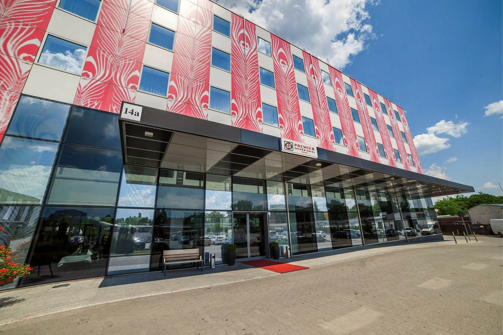

**Rola w katalogu:** duzy hotel konferencyjny w Krakowie.

**Potencjal MICE:**

- 1420 m2 powierzchni konferencyjnej.
- 9 sal konferencyjnych, w tym 7 modulowych.
- 169 pokoi dwuosobowych i 4 apartamenty.
- Parking na 230 samochodow.
- Basen i sauna sucha.
- Restauracja Impresja oraz bar hotelowy.

**Najlepsze zastosowania:** konferencje, szkolenia, bankiety, wydarzenia wymagajace noclegow i rozbudowanej logistyki.

**Zrodla:** `PKH_Oferta_Konferencyjna_2025.pdf`, `https://premierkrakowhotel.pl/`

### Express Krakow Hotel

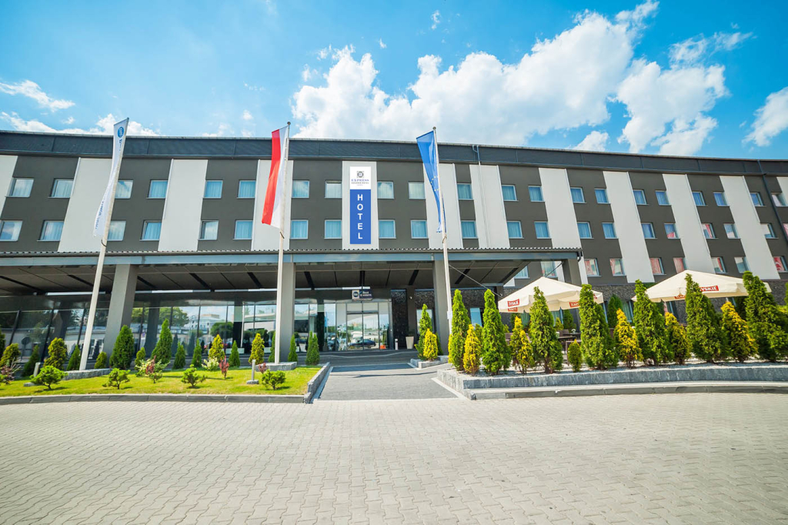

**Rola w katalogu:** drugi filar krakowskiego centrum konferencyjnego CFI.

**Potencjal MICE:**

- 705 m2 powierzchni konferencyjnej.
- 5 sal konferencyjnych.
- Sala Bursztynowa ponad 400 m2.
- 179 pokoi dwuosobowych i 1 apartament.
- Parking na 230 miejsc.
- Dostep do zaplecza Premier Krakow Hotel.

**Najlepsze zastosowania:** duze konferencje, bankiety, wydarzenia laczone z Premier Krakow Hotel, grupy noclegowe.

**Zrodla:** `PKH_Oferta_Konferencyjna_2025.pdf`, `https://expresskrakowhotel.pl/`

## Lodz

### Citi Hotel's Lodz + sala 99 Hz

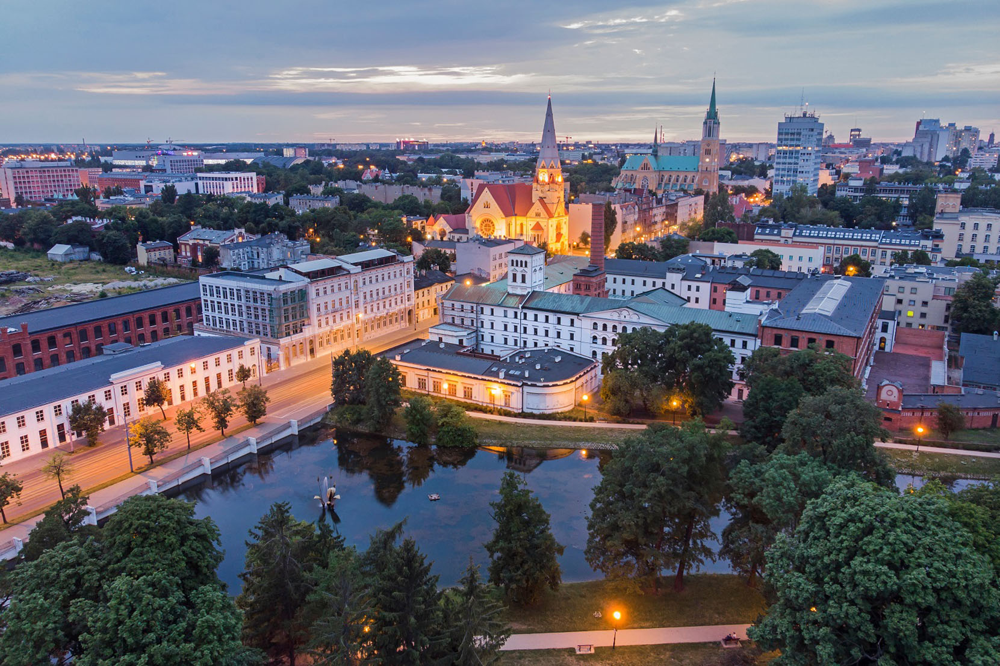

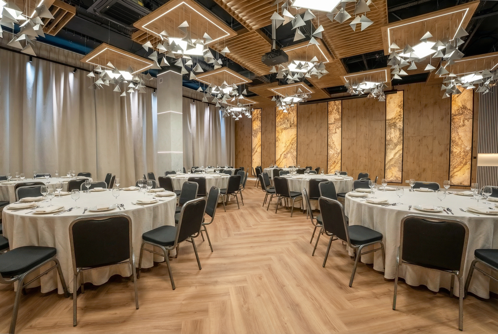

**Rola w katalogu:** miejski hotel eventowy z nowa, designerska sala 99 Hz.

**Potencjal MICE:**

- 114 pokoi.
- 230 miejsc noclegowych.
- Sala 99 Hz jako nowoczesna przestrzen konferencyjno-bankietowa.
- Oficjalna podstrona konferencyjna opisuje przestronna, dobrze oswietlona sale na 1. pietrze.
- Mozliwosc organizacji imprez okolicznosciowych, konferencji, szkolen i innych spotkan.
- Format sali: eventy firmowe, szkolenia, warsztaty, sniadania biznesowe, konferencje prasowe, gale, bankiety i wydarzenia okolicznosciowe.
- Lokalizacja przy ul. Przybyszewskiego 99.
- Kontakt: tel. +48 609 695 697, `citilodz@cfihotels.pl`.

**Najlepsze zastosowania:** city MICE, grupy biznesowe, szkolenia, konferencje prasowe, bankiety, eventy z designerskim kadrem.

**Zrodla:** `Lodz_Oferta_Konferencyjna_2025.pdf`, `99Hz.png`, `https://lodz.citihotels.pl/`, `https://lodz.citihotels.pl/konferencje/`

### Tektura by Farina Bianco / Tektura Boho

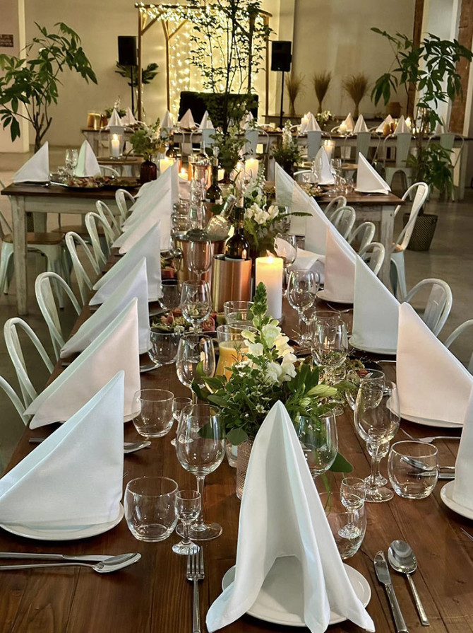

**Rola w katalogu:** nowa przestrzen eventowa w centrum Lodzi, mocna wizualnie i lifestyle'owo.

**Potencjal eventowy:**

- Format: imprezy firmowe, gale, jubileusze, premiery produktow, konferencje, szkolenia, warsztaty, networking, wernisaze, pokazy mody.
- Styl: wyrazne, boho-industrialne wnetrze, elastyczna aranzacja, autorskie menu.
- Lokalizacja: Plac Zwyciestwa 2.

**Najlepsze zastosowania:** eventy kreatywne, premiery marek, bankiety, spotkania branzowe, kolacje firmowe, wydarzenia z oprawa wizualna.

**Zrodla:** `https://www.tekturalodz.pl/`, profil Facebook Tektura.

### Farina Bianco

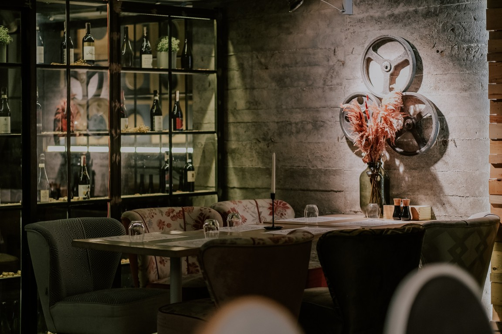

**Rola w katalogu:** najwiekszy restauracyjny format eventowy CFI w Lodzi.

**Potencjal eventowy:**

- Restauracja deklaruje 450 miejsc.
- VIP Room do 40 osob.
- Sala Time do 140 osob.
- Sala Quality do 110 osob.
- Polaczenie Time + Quality: wydarzenia do 250 osob.
- Rzutnik, ekran, mobilne sciany, mozliwosc podzialu na strefy.

**Najlepsze zastosowania:** bankiety, konferencje, szkolenia, kolacje firmowe, przyjecia z DJ-em i parkietem, wieksze spotkania restauracyjne.

**Zrodla:** `https://farinabianco.com/`, `https://farinabianco.com/eventy/`

### Gesi Puch

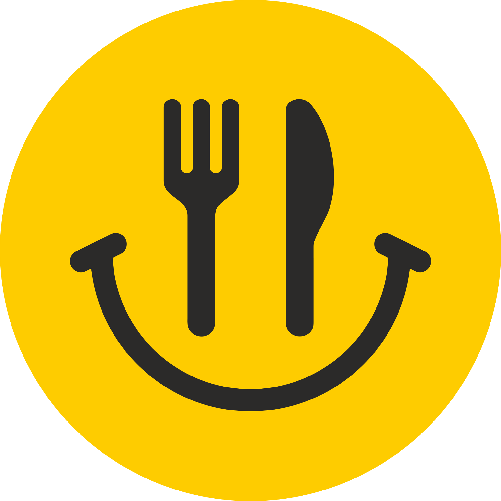

**Rola w katalogu:** polska kuchnia i bankiety w pofabrycznym klimacie Lodzi.

**Potencjal eventowy:**

- Dawna fabryka Zygmunta Richtera.
- Sala Bankietowa do 200 osob.
- Sala Kameralna do 60 osob.
- Sala Restauracyjna do 50 osob.
- Taras letni.

**Najlepsze zastosowania:** bankiety, konferencje z kolacja, przyjecia firmowe, spotkania swiateczne, przyjecia rodzinne.

**Zrodla:** `https://gesipuch.pl/onas/`

### TABU Sushi

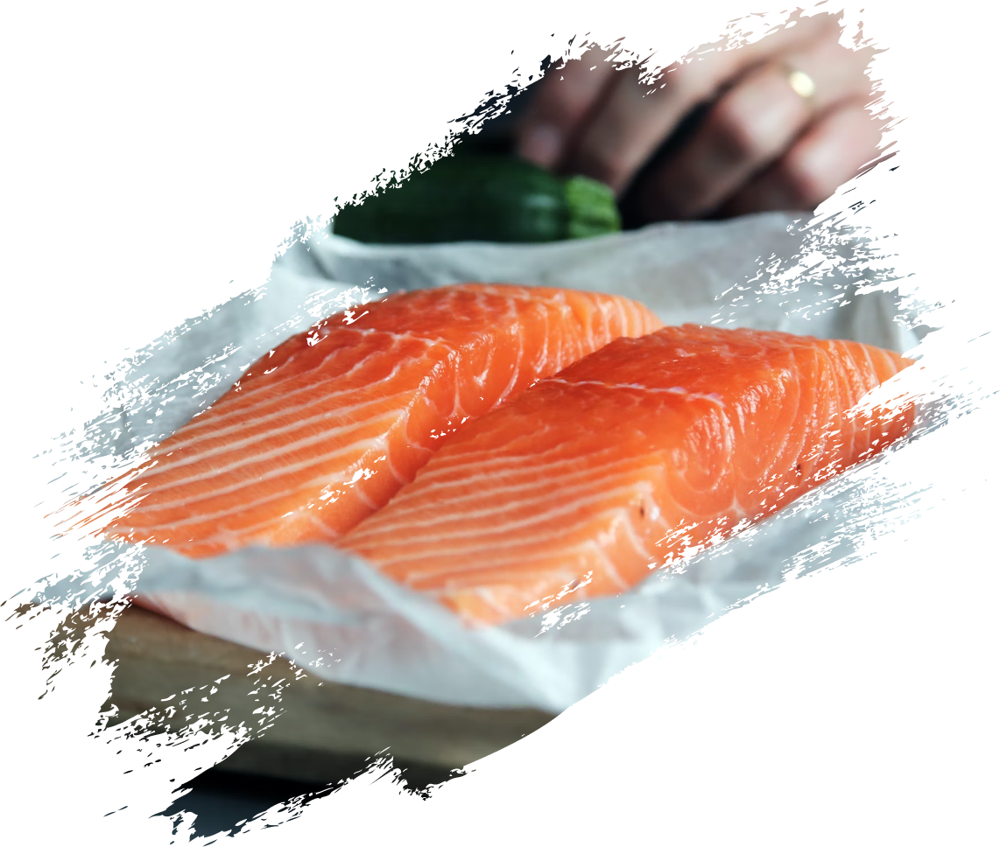

**Rola w katalogu:** private dining, executive dinner i kameralny networking.

**Potencjal eventowy:**

- Sala HANA do 18 osob.
- Sala MIRA dla 10-20 osob.
- Kuchnia japonska z inspiracjami tajskimi i koreanskimi.
- Japanese Bar Philosophy.

**Najlepsze zastosowania:** kolacje VIP, spotkania zarzadowe, private dining, after-event premium, kameralne spotkania networkingowe.

**Zrodla:** `https://tabusushi.eu/`

### Rozlam

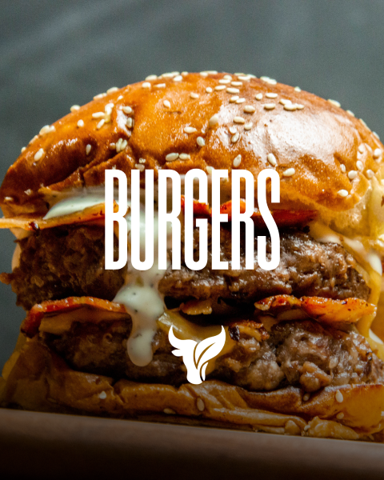

**Rola w katalogu:** miejski event dining, after-event i swobodniejsze spotkania biznesowe.

**Potencjal eventowy:**

- Lokalizacja przy al. Pilsudskiego 10.
- Pozycjonowanie: amerykanska klasyka i roslinna rewolucja.
- Menu laczy burgery, steki, tatar, zeberka oraz dania roslinne.
- Dobre miejsce na mniej formalne kolacje firmowe, wigilie firmowe, after-eventy i spotkania zespolowe.
- Format eventowy: imprezy integracyjne, kolacje integracyjne, sniadania, lunche, kolacje biznesowe, szkolenia, catering, bankiety i przyjecia rodzinne.

**Najlepsze zastosowania:** after-event, kolacja po konferencji, spotkanie zespolowe, casual business dinner, integracja, wigilia firmowa, szkolenie z lunchem, bankiet miejski.

**Zrodla:** `https://rozlam.pl/`, `https://rozlam.pl/eventy/`

### Boutique Hotel's Lodz

**Rola w katalogu:** miejska baza noclegowa i mniejsze spotkania biznesowe.

**Potencjal MICE:**

- Boutique Hotel's III Pilsudskiego: 4 sale konferencyjne, 62 pokoje, 120 miejsc noclegowych.
- Boutique Hotel's II Rewolucji: 69 pokoi, 123 miejsca noclegowe.
- Boutique Hotel's I Milionowa: 65 pokoi, 105 miejsc noclegowych.
- Dobre lokalizacje w centrum i blisko biznesowych punktow Lodzi.

**Najlepsze zastosowania:** pobyty grupowe, male i srednie szkolenia, city break biznesowy, zaplecze noclegowe dla wydarzen w restauracjach CFI.

**Zrodla:** `Lodz_Oferta_Konferencyjna_2025.pdf`, `https://www.hotels24.com.pl/`

## Poznan

### Grand Royal Hotel

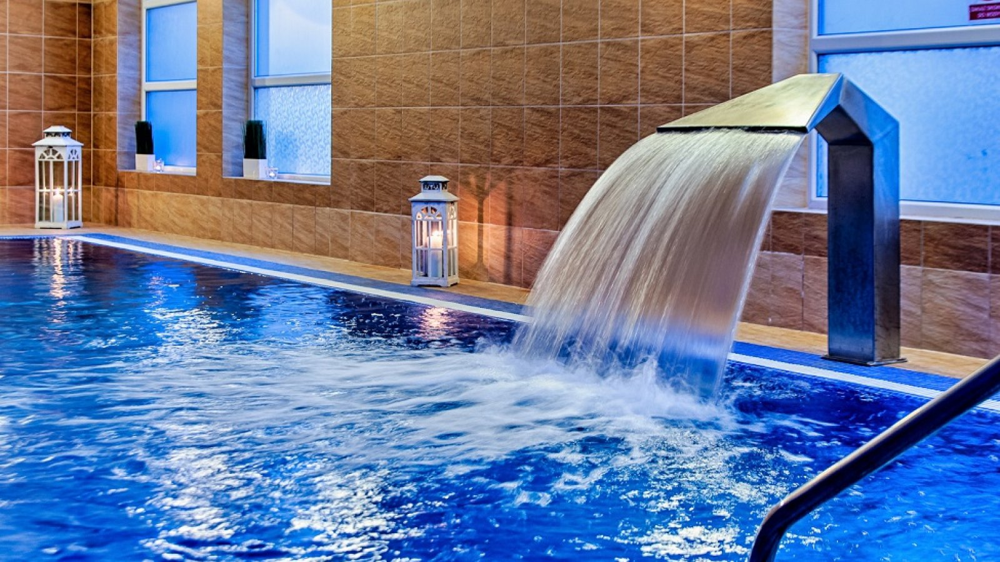

**Rola w katalogu:** kameralny hotel biznesowy w Poznaniu.

**Potencjal MICE:**

- 3 sale konferencyjne.
- Ponad 240 m2 powierzchni konferencyjnej.
- 61 pokoi typu Classic + 5 apartamentow.
- Wellness: basen, sauny, silownia.
- Blisko A2, ok. 5,5 km od MTP i dworca Poznan Glowny.

**Najlepsze zastosowania:** szkolenia, spotkania biznesowe, kameralne konferencje, pobyty przy MTP.

**Zrodla:** `CFI_prezentacja_2026_PL.pdf`, `https://grandroyalhotel.pl/`

## Kazimierz Dolny

### Krol Kazimierz Hotel & SPA

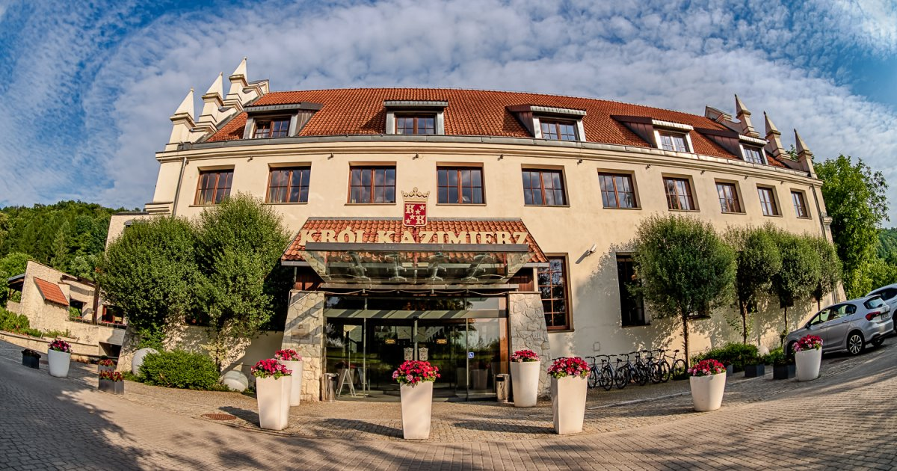

**Rola w katalogu:** destination MICE z historia i duza skala eventowa.

**Potencjal MICE:**

- Ponad 1600 m2 powierzchni eventowej.
- 8 sal konferencyjnych.
- Wydarzenia do 1000 osob.
- Ok. 250 miejsc noclegowych.
- Przeszklone patio, letni taras, SPA, wellness, basen.

**Najlepsze zastosowania:** kongresy, konferencje, bankiety, koncerty, wyjazdy incentive, wydarzenia z klimatem Kazimierza Dolnego.

**Zrodla:** `CFI_prezentacja_2026_PL.pdf`, `https://www.krolkazimierz.pl/`

## Mazury / Worliny

### Masuria Hotel & SPA

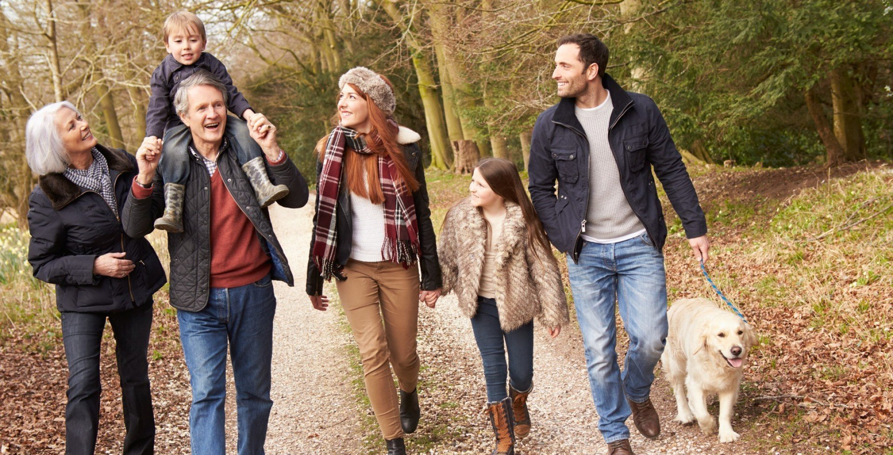

**Rola w katalogu:** MICE + natura + wellness.

**Potencjal MICE:**

- 6 sal konferencyjno-bankietowych.
- 550 m2 powierzchni.
- Do 400 osob.
- 65 pokoi / ok. 150 miejsc noclegowych.
- Prywatna plaza, pomost, SPA, wellness, basen, sauna, laznie, aktywnosci wodne.

**Najlepsze zastosowania:** wyjazdy integracyjne, konferencje z wypoczynkiem, incentive, team building, warsztaty poza miastem.

**Zrodla:** `CFI_prezentacja_2026_PL.pdf`, `https://www.hotelmasuria.pl/`

## Wroclaw

### Citi Hotel's Wroclaw

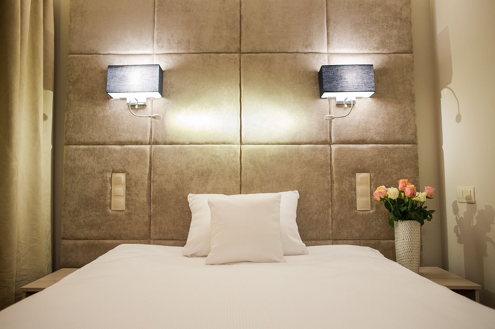

**Rola w katalogu:** miejska baza pobytowa dla biznesu.

**Potencjal MICE:**

- 63 nowoczesne pokoje.
- Lokalizacja w biznesowej czesci Wroclawia.
- Dobre rozwiazanie na krotkie wyjazdy sluzbowe i pobyty grupowe.

**Najlepsze zastosowania:** noclegi biznesowe, male spotkania, baza dla wydarzen miejskich.

**Zrodla:** `CFI_prezentacja_2026_PL.pdf`, `https://wroclaw.citihotels.pl/`

## Slask / Sosnowiec / Bytom

### Art Hotel's Sosnowiec

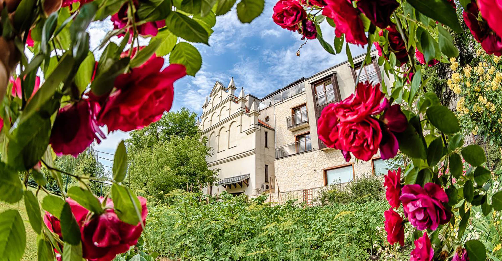

**Rola w katalogu:** kameralne spotkania biznesowe i baza noclegowa w aglomeracji slaskiej.

**Potencjal MICE:**

- 2 sale konferencyjne.
- 75 m2 powierzchni.
- Do 80 osob.
- 28 pokoi / 49 miejsc noclegowych.
- Blisko dworca, ok. 10 km do Katowic.

**Najlepsze zastosowania:** szkolenia, male konferencje, spotkania zespolowe, noclegi biznesowe.

**Zrodla:** `CFI_prezentacja_2026_PL.pdf`, `https://cfihotels.pl/#nasze-obiekty`

## Co trzeba zrobic przed wersja finalna

- Potwierdzic aktualne liczby dla Warsaw Plaza i Falent, bo PDF-y i fact sheet podaja drobne rozbieznosci.
- Wybrac finalne zdjecia hero dla kazdego obiektu, najlepiej po 1-3 na miejsce.
- Sprawdzic prawa i zgody na wykorzystanie zdjec ze stron w katalogu sprzedazowym.
- Dociagnac lepsze zdjecia dla Krol Kazimierz oraz obiektow Boutique/Slask, bo automatyczny pierwszy pobor jest nierowny.
- Ujednolicic nazwy: Tektura by Farina Bianco / Tektura Boho - do decyzji zgodnie z komunikacja marki.
- Przygotowac wersje graficzna: PDF albo PowerPoint, z mapa Polski i kartami miast.
